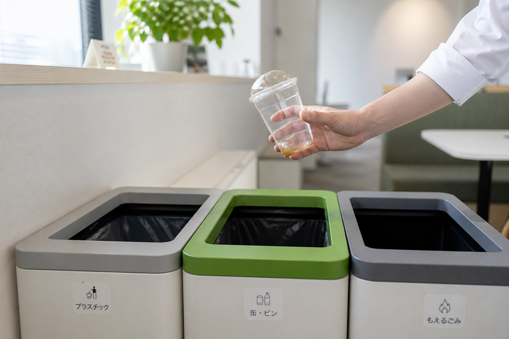

<p align="center">
  <a href="README.md">English</a>
  &nbsp;·&nbsp;
  <strong>日本語</strong>
</p>

# wayste

<p align="center">
  
</p>

<p align="center">
  <a href="https://wayste.vercel.app/"><strong>デモを見る →</strong></a>
  &nbsp;·&nbsp;
  <a href="https://wayste.vercel.app/kiosk"><strong>キオスクを試す →</strong></a>
</p>

リアルタイムでゴミの分別を判定するAIキオスク。ゴミ箱に近づいて品物を手に持つだけで、上から見下ろす固定カメラが数秒で「どのゴミ箱に捨てるか」を画面に表示します。アプリ・スマホ・ボタン操作はいりません。

オフィスや公共空間での実証実験向けに設計しました。**判定はブラウザ内で完結**するため、画像は端末から外に出ず、プライバシーが守られます。1スキャンあたりのコストもゼロ。ローカルが見たことのない珍しい品物だけ、クラウドにフォールバックします。英語と日本語に完全対応、サイトごとに分別ストリームを設定可能、画像認識のバイアス対策も入っています。

> **ステータス:** Vercelでデモを稼働中。日本国内の大学と企業のオフィスで実証実験の話を進めています。本番運用はまだ開始していません。

## なぜ作ったか

日本のオフィスや空港のゴミ箱は、4〜6種類に分かれていて（燃えるゴミ、プラスチック、ペットボトル、缶、紙、特別ゴミなど）、ラベルも情報量が多い。人は2秒ほど見て諦め、結局すべて燃えるゴミに入れてしまう。一般的なアプリでは解決できません — ゴミを片手に持ったままQRコードを読み取りたい人はいない。だから設計上の制約は **ユーザーの手間ゼロ・インストール不要・その場で答えが出る** に絞り込みました。その結果、「固定カメラはゴミと手しか映さない（顔は決して映らない）、AIモデルはブラウザ内で動く（画像は端末から外に出ない）」という構成に収束しています。

## エンジニアリングの見どころ

- **2段階のローカル優先パイプライン** — 自作15クラスのYOLO26mモデルが ONNX Runtime Web 経由でブラウザ内で動作。確信度の高い判定はサーバー呼び出しなしでその場で結果を返し、ローカルが知らない珍しい品物だけGPT-5.4 miniに任せます。よくある品物（ペットボトル、缶、紙コップ）はクラウドに到達しません。
- **画像認識の公平性** — 肌の検出はRGB値ではなくHSV色空間で判定（`h ≤ 50, 0.1 ≤ s ≤ 0.8, v ≥ 0.2`）。RGBの肌色判定は明るい肌色に偏り、現場で機能しないことが知られているからです。
- **感度1つで全閾値が決まる** — 検出に関わる閾値（前景比率、動きゲート、確信度カットオフ）はすべて、サイト設定の `sensitivity`（0〜1）という1つのつまみから計算されます。コードのあちこちにマジックナンバーを散らさない設計です。
- **HMAC署名のキオスクセッション** — `KIOSK_API_TOKEN` を鍵にした、長期有効の署名付きクッキー。トークンをローテーションするだけで配置済みの全デバイスのセッションを一括で無効化できます。新しい端末は `/kiosk/unlock` でトークンを使ってアンロック。
- **環境への自動キャリブレーション** — 起動後の最初の45フレームで、その場所固有のノイズの基準値を計測し、前景の判定基準を上書きします。同じキオスクが、強い蛍光灯下でも温色のオフィス照明下でも、再調整なしで動作します。
- **熱スロットリング検知** — CV解析にかかる時間を継続的に追跡。M1/M2 Macが熱で性能を落とし始めたら、自動でフレームレートを半分に落とし、画面に警告バッジを表示します。

---

## 何ができるのか

- カメラにかざされた物体を、ブラウザ内の画像認識で検出（クラウド不要）
- **2段階の判定パイプライン** — まずローカルYOLO、必要なときだけクラウドGPT：
  - **1段階目 — YOLO26m（必要なときだけブラウザで実行）:** 自作15クラスのゴミ検出モデル（`15class_v1.onnx`、39 MB）。ボトル、缶、コップ、袋、電池、生ゴミなど、頻出品をカバー。CVパイプラインが分類をトリガーしたときに動作し、確信度の高い検出はサーバー呼び出しなしでその場で結果を返します。
  - **2段階目 — OpenAI `gpt-5.4-mini`:** YOLOの確信度が、感度から計算したフォールバック閾値（デフォルト感度0.5で約0.725）を下回ったとき、または前景に物体が映っているのにYOLOが対応する検出を見つけられなかったときに起動します。
- **RGB材質解析** がYOLOのクラス名を、bounding boxの色（HSV）、透明度、金属性、形状（縦横比）、LBPテクスチャから細分化 — 「bottle」を「ガラス瓶」「ペットボトル」「アルミ缶」のいずれかに振り分けてからルールマッチングへ。
- 材質ヒント（色相、彩度、透明度、表面の質感）は2段階目のGPTにも渡され、クラウド側の判定精度も向上します。
- 確信度に応じた **明確な指示** を表示（生のパーセンテージはユーザーには見せません）：
  - 高確信度 → **「リサイクルへ」**
  - 中確信度 → **「これは燃えるゴミに見えます」** + 念のためゴミ箱のラベル確認の柔らかい注意
  - 低確信度 → 推測 + **「迷ったら燃えるゴミへ」** のフォールバック
- 必要に応じて **捨てる前の準備指示** を表示（例：「中身を空にしてキャップを外してください」）
- **英語・日本語** に対応。サイトごとにデフォルト言語を設定可能。
- **複合品** を検出（例：プラスチックの蓋付きコーヒーカップ）し、構成要素ごとに分別指示を分解。
- **同時に最大4品** をマルチblob解析で検出（鮮明度・コントラスト・肌比率でblobごとに品質スコアリング）。レスポンシブな分割画面（2列・3列・2×2グリッド）で、フェードインアニメーション付きで表示。
- **起動時のローディング画面** — YOLOモデルが完全に読み込まれてウォームアップが終わるまで、キオスクは入力を受け付けません。準備完了までブランドロゴ付きのプログレス表示。
- キオスク端末側の **熱スロットリング検知** — CV解析がベースラインの2倍を超えてタイムアウトすると、応答性維持のため自動でフレームレートを半減します。
- すべてのスキャンをRedisに記録し、実証実験後の分析に利用。
- 撮影画像は **Vercel Blob** にランダムサフィックス付きURL（推測不可・列挙不可）でアップロード。管理者認証されたルートからのみ参照可能。
- 日次cronでパイロットデータをBlobにアーカイブし、古い画像を自動削除。

---

## 使い方

1. カメラ付き端末で `/kiosk` を開く（初回のみ `/kiosk/unlock` で30日間有効なセッションクッキーを発行）
2. 品物（複数可）をカメラの前にかざす
3. 結果を待つ — 頻出品はその場で（YOLO26m）、GPT-5.4 miniが必要な場合は1〜3秒程度
4. 表示されたゴミ箱に品物を捨てる — 物理的なゴミ箱の並びの中での位置を、画面のインジケーターが案内
5. そのまま立ち去るか、**Done** をタップして待機画面に戻る

---

## ページ構成

| URL | 役割 |
|-----|---------|
| `/` | 公開マーケティングランディングページ（10セクション構成、デモ動画埋め込み） |
| `/kiosk` | キオスク本体 — 有効な `kiosk_session` クッキーが必要 |
| `/kiosk/unlock` | 新規キオスク端末の初回アンロックUI — 30日間有効な `kiosk_session` クッキーを発行 |
| `/insights` | 運用ダッシュボード — パイプラインファネル、誤分類トップ、日次推移（管理者認証） |
| `/review` | 人間レビュー — 全分類結果と撮影画像の一覧、Correct/Wrong/Nothing（誤検出）でマーク、フラグ付き画像のZIPダウンロード（管理者認証） |

---

## 技術スタック

| レイヤー | 採用技術 |
|-------|-----------|
| フレームワーク | Next.js 16.2.4（App Router、TypeScript） |
| スタイル | Tailwind CSS v4 |
| ローカル推論（1段階目） | YOLO26m FP16 — 自作15クラスゴミ分別モデル（`15class_v1.onnx`、39 MB）を ONNX Runtime Web で実行 |
| AI判定（2段階目） | OpenAI `gpt-5.4-mini` |
| 材質解析 | YOLO bounding box 上でRGB色解析 + LBPテクスチャ解析 — クラス名を細分化し、GPTへヒントを供給 |
| ローカル検出 | OffscreenCanvas で背景差分を120×120の正方形・約33fps で処理。マルチblob解析（最大4個）、自動キャリブレーション |
| レスポンス検証 | モデル出力すべてに Zod スキーマ検証 |
| API セキュリティ | HMAC署名セッショントークン + 2段階認証（キオスクトークン / 管理者キー） |
| データベース | Upstash Redis（パイロットログ + 管理者レビュー判定） |
| 画像ストレージ | Vercel Blob（撮影フレーム、日次JSONLアーカイブ） |
| ホスティング | Vercel |

---

## ローカル開発

### 前提

- Node.js 18+
- OpenAIアカウント（APIクレジット必要）
- Webカメラ

### インストールと起動

```bash
git clone https://github.com/ryuto1127/wayste.git
cd wayste
npm install
```

`.env.local` を作成：

```env
OPENAI_API_KEY=sk-...
```

```bash
npm run dev
```

- [http://localhost:3000](http://localhost:3000) → 公開マーケティングランディングページ
- [http://localhost:3000/kiosk](http://localhost:3000/kiosk) → キオスク本体（カメラアクセスを許可）

開発時は `KIOSK_API_TOKEN` 未設定の場合、キオスクセッションのチェックがバイパスされるため `/kiosk` を直接開けます。

> **カメラ反転について:** デフォルトでは映像を **反転していません** — 外向きの固定キオスクカメラ向けに正しい挙動です（パッケージの文字が正しく読める）。ノートPCの内蔵カメラ（自撮り用）でテストする場合は、`.env.local` に `NEXT_PUBLIC_MIRROR_CAMERA=true` を追加すると映像が反転します。

---

## デプロイ

### 1. GitHubにpushしてVercelにデプロイ

```bash
vercel --prod
```

または、GitHubリポジトリをVercelに接続して、`git push` ごとに自動デプロイ。

### 2. ストレージを追加

```bash
# Redis — パイロットログとユーザーフィードバックを保存
vercel integration add upstash
```

Blob（画像ストレージ）は **Vercelダッシュボード → Storage → Create Database → Blob** から追加。

### 3. 環境変数をローカルに同期

```bash
vercel env pull
```

### 環境変数

| 変数 | 必須 | 説明 |
|----------|----------|-------------|
| `OPENAI_API_KEY` | Yes | OpenAI APIキー |
| `KV_REST_API_URL` | 本番 | Upstash Redis REST URL |
| `KV_REST_API_TOKEN` | 本番 | Upstash Redis トークン |
| `BLOB_READ_WRITE_TOKEN` | 本番 | Vercel Blob トークン |
| `SITE_ID` | No | 読み込むサイト設定（デフォルト: `japan-office`）。サイト設定の `defaultLocale` がUI言語を決定 |
| `BLOB_ENABLED` | No | `false` で画像アップロードを完全に停止（デフォルトは有効） |
| `NEXT_PUBLIC_MIRROR_CAMERA` | No | フロント・自撮りカメラの場合は `true`、外向きキオスクカメラなら未設定または `false` |
| `RATE_LIMIT_MAX` | No | 1分あたりIP単位の最大判定リクエスト数（デフォルト: `15`） |
| `OPENAI_DAILY_BUDGET` | No | UTC日単位のOpenAI判定呼び出しの上限。推奨: 実証実験 `500`、本番 `5000`。未設定で上限なし |
| `KIOSK_API_TOKEN` | 本番 | **サーバー専用** のベアラートークン。キオスク用エンドポイント（`/api/classify`、`/api/pilot-log` POST）で必須。localhost開発時は省略すれば認証スキップ。`NEXT_PUBLIC_*` で公開してはならない。新端末は `/kiosk/unlock` でアンロック |
| `BLOB_STORE_HOST` | 本番 | Vercel Blobストアの完全なホスト名（例: `abc123.public.blob.vercel-storage.com`）。Blobベアラートークンが攻撃者管理のストアへ送信されるのを防止 |
| `ADMIN_API_KEY` | No | 管理者ページ（`/insights`、`/review`）のパスワード。HTTP Basic Auth → 4時間のセッションクッキー。dev時は省略可。ローテーションで全セッションを失効 |
| `CRON_SECRET` | No | `/api/cron/cleanup` 用のVercel Cron認証シークレット |
| `BLOB_RETENTION_DAYS` | No | cron jobで撮影画像を削除するまでの日数（デフォルト: `90`） |
| `NEXT_PUBLIC_INFERENCE_BACKEND` | No | `onnx`（デフォルト、ブラウザのONNX Runtime）または `http`（ローカル推論サーバー） |
| `NEXT_PUBLIC_INFERENCE_URL` | No | `NEXT_PUBLIC_INFERENCE_BACKEND=http` の場合のローカル推論サーバーURL（デフォルト: `http://localhost:8000/detect`） |

---

## 判定の流れ

```
ユーザーが品物をカメラの前にかざす
        ↓
ローカルCVパイプラインが物体を検出
（背景差分、ROI blob検出 — すべて端末内で完結）
        ↓
動き + 鮮明度ゲートを通った高品質フレームを5枚蓄積
        ↓
── 1段階目: YOLO26m FP16（必要なときだけブラウザで実行）─────────────────
CVパイプラインが分類をトリガーするとYOLO26m（自作15クラスゴミ分別モデル）が起動。
15クラスすべてがゴミの品物（ボトル、缶、コップ、袋、電池、生ゴミなど）であり、
すべての検出が分別ストリームに対応している。
        ↓
最良検出のbounding boxにRGB材質解析を実行：
  · 色（HSV）、透明度、金属性、bbox 縦横比
  · LBPテクスチャ解析 → 紙 / プラスチック / 金属の表面推定
  · refineClassName が一般的なYOLOラベルを細分化
    （例: "bottle" → "ガラス瓶"、"ペットボトル"、"アルミ缶"）
        ↓
YOLO26m の確信度 ≥ YOLO_FALLBACK_THRESHOLD（デフォルト感度0.5で約0.725）の場合
        → 結果を即座に返す（その場で完了、サーバー呼び出しなし）
        → YOLO単独ログを /api/pilot-log に送信（非同期）
        ↓
── 2段階目: OpenAI gpt-5.4-mini ──────────────────────────────────────────
YOLOの確信度がフォールバック閾値より下、または前景に物体が映っているのに
YOLOが対応する検出を見つけられなかったときに起動。
  · 中央の短辺正方形クロップ（例: 1280×720から720×720）を /api/classify に送信
  · 材質ヒント（色、透明度、テクスチャ）が利用可能な場合は同梱 —
    GPTのプロンプトに「ローカル解析: transparent=true, metallic=false, ...」を追加
  · gpt-5.4-mini が品物 + 任意の preAction 指示を判定
  · Zod がモデルJSON出力を検証。未知のストリームIDは needs_review にフォールバック
  · 複合品（複数構成の物体）を検出し、構成要素ごとの分別指示に分解
        ↓
── 共通経路 ──────────────────────────────────────────────────────────────
オーバーライドルールを適用（単語境界マッチング、特異性順）
        ↓
信頼レベルを判定：
  ≥70%   → high    → 「[BIN] へ」
  40〜70% → medium  → 「これは [BIN] に見えます」 + ゴミ箱ラベル確認の注意
  <40% / review   → low     → 推測 + 「迷ったら [default] へ」
        ↓
必要に応じて事前アクションを表示（例: 「中身を空にしてキャップを外してください」）
        ↓
1品ならフルスクリーンヒーロー、2〜4品なら分割グリッドで結果を表示。
各blobは中心位置の近さでYOLO検出と対応づける — マッチしなかったblobで
品質スコア（鮮明度+コントラスト）が高いものはGPTに送信、低いものは廃棄。
Blobへのフレームアップロード + Redisログは非同期で実行（レスポンスをブロックしない）
```

---

## 信頼性のための機能

| 機能 | 動作 |
|---------|-----------|
| **エラーバウンダリー** | 描画クラッシュ時に復旧画面を表示し、10秒後に自動リロード |
| **APIタイムアウト** | OpenAI呼び出しは15秒で打ち切り — キオスクが永久にハングすることはない |
| **設定可能なレート制限** | `RATE_LIMIT_MAX` 環境変数でIP単位の上限を制御（デフォルト15/分）。429時はクライアント側で1.2秒待機して1回再試行 |
| **エラーの差別化** | タイムアウトには「接続が遅い」、それ以外の失敗には「判定に失敗しました」を表示 — 黙ってのみ込まない |
| **設定ホットリロード** | サイト設定は5分キャッシュ — オーバーライド更新は再起動なしで反映 |
| **保留品キュー** | 1スロットのキュー。処理中・結果表示中・クールダウン中に検出された品物を保持し、クールダウン明けは待機状態をスキップして直接 `object_detected` に遷移 |
| **キオスクセッションクッキー** | HMAC署名された長期有効の `kiosk_session` クッキー（30日）が判定 + ログPOSTを認可。`KIOSK_API_TOKEN` ローテーションで全クッキーを一括失効 |
| **モデル起動ゲート** | 起動時にYOLOモデルを読み込みウォームアップ。`overallReady` がtrueになるまでローディング画面で入力をブロック |
| **熱スロットリング** | CV解析時間を継続追跡。平均がベースラインの2倍を超えると（M1/M2 Macの熱スロットリング）、フレームレートを自動半減し警告バッジを表示 |

---

## セキュリティ

### セッショントークン方式

新規キオスク端末は `POST /api/kiosk/session`（または `/kiosk/unlock` UI）でベアラー `KIOSK_API_TOKEN` をHMAC-SHA256署名された `kiosk_session` クッキーに交換します。クッキーは30日有効。`KIOSK_API_TOKEN` をローテーションすると発行済みクッキーすべてが失効します。すべての判定とログPOSTは、クッキーまたはベアラートークンを検証してから処理を開始します。

### 2段階認証

| 段階 | 環境変数 | 仕組み | 保護対象エンドポイント |
|------|---------|-----------|---------------------|
| キオスク | `KIOSK_API_TOKEN` | `kiosk_session` クッキー または `Authorization: Bearer <token>` | `/api/classify`、`/api/pilot-log`（POST） |
| 管理者 | `ADMIN_API_KEY` | HTTP Basic Auth → 4時間のセッションクッキー（middleware） | `/insights`、`/review`、`/api/review/*`、`/api/dashboard-metrics`、`/api/pilot-log`（DELETE） |

両方とも環境変数が未設定の場合は認証なしで動作するので、ローカル開発に追加設定は不要です。管理者認証は middleware で完結 — 初回のBasic Authプロンプト後はセッションクッキー（4時間）でパスワード入力をスキップ。

### 画像のプライバシー

撮影画像は Vercel Blob に公開アクセス権付きでアップロードします（`@vercel/blob` v2 がサーバーサイド読み取りに必要とするため）。プライバシーはアプリケーションレイヤーで担保：
- URLにランダムサフィックスを付与 — 推測不可・列挙不可
- URLは管理者認証されたルート（`/review`、`/api/pilot-image`）からのみ参照可能
- 画像は `BLOB_RETENTION_DAYS` 経過後に自動削除（デフォルト90日）
- `BLOB_ENABLED=false` で画像アップロードを完全に停止可能

---

## 画像認識パイプライン

ローカルCVパイプラインは、RGBヒューリスティックではなく **HSV色空間での肌検出** を採用しています。HSVのアプローチ（`h ≤ 50, 0.1 ≤ s ≤ 0.8, v ≥ 0.2`）は肌色全般に対して有意に公平 — 明るい肌色寄りに偏るRGB範囲閾値の問題を回避します。肌比率ゲート（`MAX_SKIN_RATIO = 0.80`）が「手そのものを物体として誤分類」することを防ぎつつ、手に持った品物は検出可能にしています。

**自動キャリブレーション**: 起動後45フレーム（背景の安定化期間）の間に、ノイズの基準値（前景比率の平均、標準偏差、最大blobのベースライン）を計測。これを使ってその場所固有の `ROI_FG_THRESHOLD` を計算し、各カメラのノイズ特性に適応します。

**感度**: サイト設定の単一の `sensitivity` パラメータ（0.0 = 厳しい、1.0 = 敏感、デフォルト 0.5）が、`lib/threshold-config.ts` の `computeThresholds()` を通してすべての検出と判定の閾値を制御します。利用可能なときは自動キャリブレーションが前景閾値を上書きします。

タイミングはキオスクの応答性に最適化：
- **結果表示**: 品物が取り除かれるまで表示し続ける（30秒のセーフティアウト）
- **クールダウン**: スキャン間1.5秒
- **物体除去の判定**: 連続3フレーム空（感度 > 0.7では2フレーム）

### 保留品キュー

連続スキャンが瞬時に感じられるよう、パイプラインは1スロットのキューを保持します。処理中（判定中・結果中・クールダウン中）に前景blobが3フレーム連続で検出されると、保留フラグが立つ。クールダウン明けは待機状態を完全にスキップして直接 `object_detected` に遷移するので、ユーザーが品物を再提示しなくても次のスキャンが即始まります。キュー深度は1 — 2つ目の到着は1つ目を上書き（last-wins）。手動再キャリブレーションでキューはフラッシュされます。

---

## 分別ルールのカスタマイズ

ルールは `config/sites/` のJSONファイルで管理。コード変更不要です。

### サイト設定の構造

```json
{
  "siteId": "my-office",
  "siteName": "My Office — 2nd Floor",
  "defaultLocale": "en",
  "reviewThreshold": 0.55,
  "sensitivity": 0.5,
  "mirrorCamera": false,
  "streams": [
    { "id": "recycling", "label": "Recycling", "color": "#2563EB", "description": "..." },
    { "id": "compost",   "label": "Compost",   "color": "#16A34A", "description": "..." },
    { "id": "landfill",  "label": "Landfill",  "color": "#525252", "description": "..." }
  ],
  "overrides": [
    { "pattern": "coffee cup", "stream": "landfill", "note": "Lined cups are not recyclable." }
  ],
  "siteRules": [
    { "pattern": "toner", "instruction": "Leave by the copy room.", "stream": "special", "requiresStaff": true }
  ],
  "staffHandlingItems": ["fluorescent", "chemical"],
  "defaultStream": "landfill"
}
```

新しい場所のルールを作るときは、`config/sites/japan-office.json`（デフォルト）または `config/sites/office-hq.json` を `config/sites/your-site.json` にコピーして編集し、Vercelの環境変数に `SITE_ID=your-site` を設定。日本語が中心のサイトなら `defaultLocale` を `"ja"`、英語が中心なら `"en"` に。

### 日本語の分別ストリーム

`japan-office` 設定は、日本語にローカライズされたストリーム（`burnable`、`non-burnable`、`recyclable`、`plastic`、`special`、`needs_review`）の例を提供しています。オーバーライドは日本語の品名にも対応（例：`ペットボトル` → recyclable、`電池` → special）。詳細は `config/sites/japan-office.json` を参照。

### オーバーライドのパターンマッチ

パターンは **単語境界マッチング** — `"cup"` というパターンは `"paper cup"` に合致しますが `"cupcake"` には合致しません。パターンは特異性順にマッチング — `"coffee cup"` は `"cup"` より自動的に優先されます。

### 信頼度の閾値

`reviewThreshold`（デフォルト `0.55`）は、結果を「不確実」として hedge 表示にする境界を制御。下げると寛容に、上げるとより高い確信度を要求してから断定するようになります。

---

## 実証実験後のワークフロー

実環境テストの後：

1. `/insights` でパイプラインファネル、誤分類トップ、日次推移を確認
2. `/review` で **全分類結果** を撮影画像付きで一覧表示。フィルタ可能なグリッドで、エントリごとにモデル名と鮮明度スコアを表示
3. 各エントリを **Correct**、**Wrong**（モデルのクラス名が画像と合っていない）、**Nothing**（誤検出）でマーク
4. フラグ付き画像（Wrong + 低確信度のCorrect）の **ZIPアーカイブ** をダウンロードしてアノテーションツールに投入
5. インサイトをもとに `config/sites/*.json` にオーバーライドルールを追加

> **注意:** インサイトの統計は `/review` で管理者レビュー済みのものだけを集計しています — キオスク内のフィードバックボタンは存在しません。未レビューは除外されるため、統計は確認済みデータのみを反映します。

生データはすべてUpstashコンソールで参照可能：
- `recycling:pilot-log` — すべての判定結果（品物、ストリーム、確信度、使用モデル、応答時間、画像URL）
- `recycling:review-verdicts` — 管理者レビュー判定（correct / wrong / false_detection）。requestIdをキーに保存

### データ保持

Vercel Cron が毎日UTC 03:00（`/api/cron/cleanup`）に：
1. 現在のパイロットログをJSONLファイルとしてBlobの `archives/YYYY-MM-DD/` にアーカイブ
2. `BLOB_RETENTION_DAYS` を超えた撮影画像を削除（デフォルト90日）

別途、週次cron（`/api/cron/export-finetuning`）がパイロットログを構造化されたファインチューニング用データセットとしてBlobにエクスポートし、再学習に使える状態にします。

インサイトダッシュボードの日付範囲データ管理UIから手動パージも可能（内部的に `DELETE /api/pilot-log` を呼び出します）。

---

## プロジェクト構成

```
├── app/
│   ├── api/
│   │   ├── calibration/         # キャリブレーション予測の追跡（Redisバック）
│   │   ├── classify/            # 単発 + バッチ判定（GPT-5.4 mini、オーバーライド、Blobアップロード）
│   │   ├── cron/
│   │   │   ├── cleanup/             # 日次cron: パイロットログをBlobへアーカイブ、古い画像を削除
│   │   │   └── export-finetuning/   # 週次cron: パイロットログをファインチューニング用データセットとしてBlobへエクスポート
│   │   ├── dashboard-metrics/   # /insights 用のGET集計（ファネル + 誤分類トップ + 推移）
│   │   ├── health/              # サービスヘルスチェック
│   │   ├── kiosk/
│   │   │   └── session/         # POST: KIOSK_API_TOKEN を kiosk_session クッキーに交換
│   │   ├── kiosk-stats/         # 当日の判定成功率（管理者レビュー済みのみ）
│   │   ├── pilot-image/         # Blobホスト撮影フレームの署名URLプロキシ
│   │   ├── pilot-log/           # パイロットログの読み書き・削除（GET/POST/DELETE）
│   │   ├── review/              # レビュー判定、エントリ削除、ZIP/CSVエクスポート
│   │   └── site-config/         # クライアント用にサイトの defaultLocale + streams を返す
│   ├── demo/screens/            # 内部用画面状態ショーケース（ユーザー非公開）
│   ├── insights/                # 運用ダッシュボード（ファネル、誤分類、推移）
│   ├── kiosk/                   # キオスク表示（page.tsx）+ アンロックフロー（unlock/page.tsx）+ ダーク固定ビューポートのレイアウト
│   ├── review/                  # 人間レビュー — Correct/Wrong/Nothing 判定、ZIPエクスポート
│   └── page.tsx                 # 公開マーケティングランディングページ（10セクション構成）
├── components/
│   ├── AdminNav.tsx             # 管理者用共通ナビ（insights ↔ review ↔ kiosk）
│   ├── CameraFeed.tsx           # カメラ初期化 + フレームキャプチャ（mirror prop対応）
│   ├── CameraScreen.tsx         # カメラビュー状態（scanning / detecting）
│   ├── ErrorBoundary.tsx        # 自動リロード付きクラッシュ復旧
│   ├── IdleScreen.tsx           # 待機 / アトラクション画面
│   ├── KioskDisplay.tsx         # CVパイプライン + 状態機械オーケストレーター
│   ├── PerformancePanel.tsx     # タブごとのパフォーマンスチャート（CV、YOLO、熱）— review ページ用 |
│   ├── ResultScreen.tsx         # フルスクリーン / 分割画面の結果表示（1〜4品、2×2グリッド）
│   ├── SystemStatusBadge.tsx    # YOLOモデル + 熱警告のステータス表示
│   └── insights/                # /insights ビュー + チャートサブコンポーネント
│       ├── InsightsView.tsx
│       ├── MetricsTimeseries.tsx
│       ├── MisclassTopChart.tsx
│       └── PipelineFunnel.tsx
├── config/
│   └── sites/                   # 場所ごとの分別ルールJSONファイル
│       ├── airport.json
│       ├── japan-office.json    # デフォルトサイト — 日本語ストリーム（burnable / non-burnable / recyclable / plastic / special）
│       ├── office-hq.json
│       └── pilot.json
├── public/
│   └── models/                  # ブラウザ配信ONNX資産
│       ├── 15class_v1.onnx          # YOLO26m FP16 — ランタイム検出モデル
│       └── yolo-rules.json          # YOLOクラス → 分別ストリームのマッピング
├── kiosk/                       # キオスクデプロイスクリプト
│   ├── setup-mac.sh                 # macOS M1/M2 セットアップ（スクリーンセーバー、自動更新、LaunchAgent）
│   ├── start-kiosk-mac.sh           # Chromeキオスクモードの自動再起動
│   ├── setup-pi.sh                  # Raspberry Pi セットアップ
│   ├── start-kiosk.sh               # 汎用Linuxキオスク起動
│   ├── backup-data.sh               # データバックアップスクリプト
│   └── kiosk.desktop                # Linuxデスクトップエントリ
├── training/                    # オフラインデータセット準備 + モデル学習（Python; ランタイム外）
│   ├── finetune_yolo26n.ipynb       # 自作データセットでのYOLO26nファインチューニング
│   ├── train_clean.py               # クリーンデータ学習エントリ
│   ├── prepare_dataset.py           # データセット準備（OIDv6 + TACO）
│   ├── prepare_pilot_data.py        # パイロットログ画像を学習データに変換
│   ├── build_*_dataset.py           # クラスセット別データセットビルダー（39/42/46クラス）
│   ├── ai_curate.py / ai_verify_class.py / filter_quality.py  # 品質 + クラス検証
│   └── ...                          # その他ノートブック、エクスポーター、補助スクリプト
├── __tests__/                   # Jestユニットテスト（下「テストの実行」を参照）
├── middleware.ts                # 管理者Basic Auth → 4時間セッションクッキー
├── instrumentation.ts           # Next.js instrumentation hook（起動時の環境変数検証）
└── lib/
    ├── audit-log.ts                 # 追記専用の管理者アクションログ
    ├── auth.ts                      # （レガシー / 未使用）— kiosk-auth.ts + middleware で代替
    ├── background-task.ts           # waitUntil ラッパー（レスポンス後の処理用）
    ├── bbox-utils.ts                # IoU、フレームフィンガープリント、貪欲bboxマッチング
    ├── blob-store.ts                # Vercel Blobアップロードヘルパー
    ├── blob-url.ts                  # Blob URLホスト名のallow-list検証
    ├── calibration.ts               # キャリブレーション予測追跡（Redis）
    ├── crypto-utils.ts              # HMAC + 一定時間文字列比較
    ├── daily-budget.ts              # UTC日単位のOpenAI呼び出し上限
    ├── dashboard-metrics.ts         # /insights レスポンスを構築する純粋関数
    ├── empty-module.js              # ONNX Runtime のサーバーサイドimport用スタブ
    ├── env-validation.ts            # 起動時環境変数検証
    ├── face-detect.ts               # ブラウザ顔検出（プライバシーフィルター）
    ├── face-detect-server.ts        # サーバーサイド顔検出（プライバシーフィルター）
    ├── frame-analyzer.ts            # ローカルCVパイプライン（背景モデル、マルチblob検出）
    ├── i18n.ts                      # EN/JA翻訳
    ├── inference-backend.ts         # YOLO推論バックエンド抽象化（ONNX または HTTP）
    ├── insights-helpers.ts          # /insights 用クライアントヘルパー
    ├── kiosk-auth.ts                # HMAC署名 `kiosk_session` クッキー + ベアラートークン検証
    ├── kiosk-counter.ts             # ストリームごとの分別カウンター（待機画面の生統計）
    ├── kiosk-stats.ts               # 当日の成功率（管理者レビュー済みのみ）
    ├── material-vocabulary.ts       # GPTサブ分類プロンプト用の材質視覚キュー
    ├── milestone-check.ts           # レビュー閾値達成時のマイルストーン通知（Resend）
    ├── models/                      # サーバーサイドで使うバンドル済みONNX資産（顔検出器）
    ├── notifications.ts             # Resendメールヘルパー
    ├── offline-cache.ts             # ブラウザlocalStorageの結果キャッシュ（50件、24h TTL）
    ├── openai-pricing.ts            # トークン使用量 → USD換算（予算追跡用）
    ├── perf-monitor.ts              # タブ内パフォーマンスモニター + BroadcastChannel同期
    ├── pilot-log.ts                 # Redisログ（recycling:pilot-log リスト）
    ├── pilot-log-schema.ts          # パイロットログエントリのZodスキーマ
    ├── redis.ts                     # Upstash Redisクライアント + キー定数
    ├── request-id.ts                # ログ相関用のリクエストごとUUID
    ├── rgb-material-analyzer.ts     # YOLO後のRGB/テクスチャ材質解析（色、LBP、形状）
    ├── site-streams-context.tsx     # サイトストリームをクライアントコンポーネントに渡すReactコンテキスト
    ├── threshold-config.ts          # マスター感度 → 閾値計算
    ├── types.ts                     # 共有TypeScript型
    ├── waste-rules-core.ts          # コアルールエンジン（パターンマッチング、ストリーム解決）
    ├── waste-rules.ts               # ルールエンジン公開API（オーバーライド、結果構築、GPTプロンプト）
    ├── yolo-inference.ts            # YOLO26m FP16 ONNX Runtime Web 推論（必要なときだけ）
    └── yolo-rules.ts                # YOLOクラス名 → 分別ストリームマッピング（/models/yolo-rules.json を読み込み）
```

---

## テストの実行

```bash
npm test
```

18スイート、合計442のユニットテスト。状態機械、CVパイプライン閾値、感度由来閾値、オーバーライドのパターンマッチング、オフラインキャッシュ、通知、判定APIルート、RGB材質/テクスチャ解析、複数品blob検出、順次モデルローディング、bboxユーティリティ、ダッシュボードメトリクス + 統合、insightsヘルパー、OpenAIの価格と予算、解析エクスポートをカバー。

---

## ライセンス

MIT
